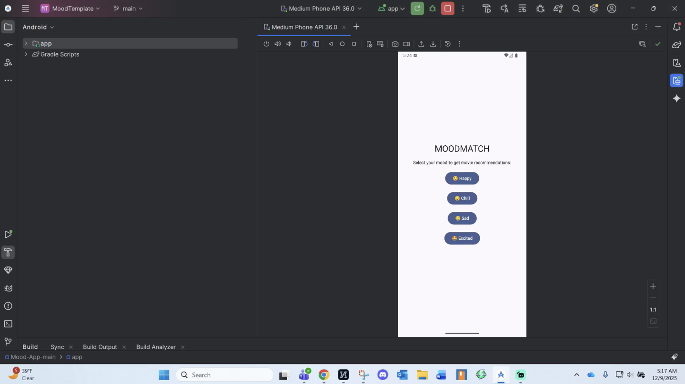

# AND101 Milestone 2 - **MovieMood**

Submitted by: 
-  **Antonio Logan**
-  **Danielle Devose**
-  **Ondrea Wagner**

Time spent: **12** hours spent in total

## Summary

This document provides a summary of our project building process for our app, **MovieMood**

## Milestone Requirements

The following REQUIRED features are completed:

- [x] Assign features to each member of your group
- [x] Establish a goal time for completing each feature

The following REQUIRED files are included:

- [x] Updated 📄 `project_spec.md`, which contains:
  - [x] App Overview (Milestone 1)
  - [x] App Spec (Milestone 1)
        
  - [ ] Comlpeted CodePath required features
  * [x] Feature 1: Uses a RecyclerView.
  * [ ] Feature 2: Uses consistent custom styling.
        
  - [x] Checked off 2+ completed features
* [x] Feature 1: User selects a mood (e.g., happy, chill, sad, excited).
* [x] Feature 2: App fetches a list of recommended movies using TheMovieDB API.
* [x] Feature 3: Each movie card displays title, brief description, and rating.
* [x] Feature 4: User can tap a movie to see a detail page with overview, genre, release date, and large movie poster.
* [x] Feature 5: Basic navigation between Home (mood selector), Results (movie list), and Details screens.

  - [x] 2+ Videos/GIFs of build progress

- [x] Our 🎥 Demo Video
  - [x] We have also added the Demo Video Link to the Group Info Form on the course portal.

## 🎥 Demo Video

Here's a video that demos all of the app's implemented features:
**CLICK THE THUMBNAIL TO PLAY**  
**YOUTUBE VERSION** : (https://youtu.be/4clu_PKIkK4)

VIDEO created with **iMovie**

## Notes

Here's a place for any other notes on this milestone!
